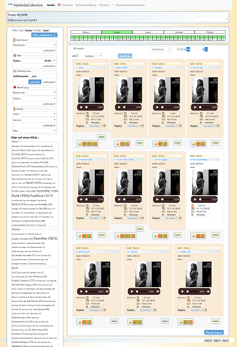

# MyMediaCollection

MyMediaCollection is an application for managing your media-resources as audio, video.

For more information take a look at documentation:
- [portalinfo](docs/INFO.md)
- [changelog](docs/CHANGELOG.md) 
- [installation instructions](docs/INSTALL.md)
- [configuration instructions](docs/CONFIGURATION.md)
- [usage instructions](docs/DATAIMPORT.md)
- [credits for used libraries](docs/CREDITS.md)

MyMediaCollection bases on mysimplehomepage-4.0.0 and mytourbook-7.0.0.

