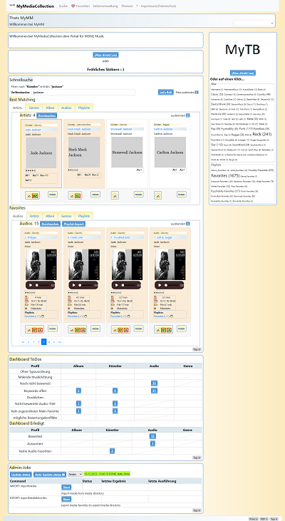

# What is MyMediaCollection

MyMediaCollection is a portal for managing your mp3-collection with a bunch of different page types and features:

- starting with sectionpage for different content-sections, dashboard and job-manager as startpage .... 
- sectionlists to order the sections and give an overview
- searchpages per section offering a bunch faceting filters and showing results with audios 
- several actions as edit, delete, merge, tag, rate, playlist and others to manage and filter your music   
- in selectable different layouts as list/small/big/page....
- detailpage showing the data of musicians, album, generate and related information of a item 
- simple configuration of pages in pdocs-de.json if you use the static PDocDataService.
```
{
 "pdocs": [
  {
   "id": "menu",
   "descMd": "Hauptmenü",
   "flgShowTopTen": false,
   "flgShowSearch": false,
   "heading": "Hauptmenü",
   "name": "Hauptmenü",
   "subSectionIds": "start,vita,roadmap",
   "teaser": "Hauptmenü",
   "type": "SectionOverviewPage"
  },
  {
   "id": "start",
   "descMd": "# Ieiunia non dempto\n\n## Quem in...",
   "flgShowTopTen": false,
   "flgShowNews": false,
   "flgShowSearch": false,
   "heading": "Thats MySimpleHomePage",
   "name": "Willkommen",
   "subSectionIds": "skills,me",
   "teaser": "Willkommen bei MySimpleHomePage",
   "type": "SectionOverviewPage"
  },
```
